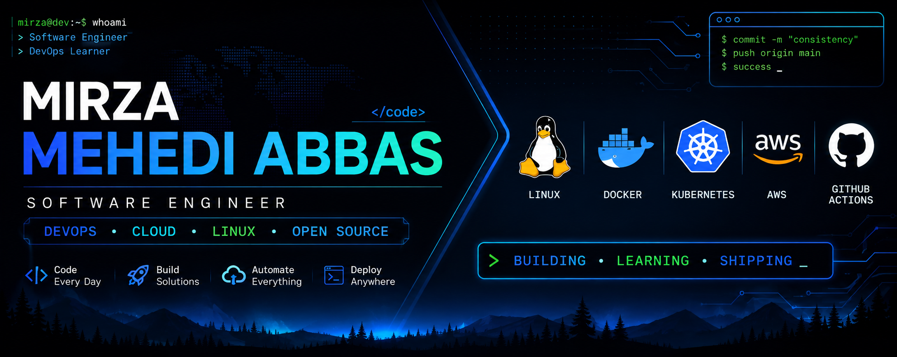

<!-- Banner -->

<p align="center">

</p>

<h1 align="center">
Hi 👋, I'm Mirza Mehedi Abbas
</h1>

<h3 align="center">
Software Engineer • DevOps Learner • Linux Enthusiast • Open Source Contributor
</h3>

<p align="center">

</p>

<p align="center">

<a href="https://github.com/mmabbas786">

</a>

<a href="https://github.com/mmabbas786?tab=repositories">

</a>


</p>

---

# 👨‍💻 About Me

```yaml
Name: Mirza Mehedi Abbas

Role:
  Software Engineer

Currently Learning:
  - Linux
  - Git
  - Docker
  - Kubernetes
  - AWS
  - Terraform
  - GitHub Actions

Interests:
  - DevOps
  - Cloud Computing
  - System Design
  - Open Source
  - Backend Development

Current Goal:
  Become a Professional DevOps Engineer
```

---

# 🚀 What I'm Working On

- 📘 Documenting my DevOps journey every day
- 🐧 Mastering Linux from beginner to advanced
- 🐳 Learning Docker and containerization
- ☸ Building Kubernetes projects
- ☁ Exploring AWS Cloud
- 🔧 Automating deployments using GitHub Actions
- 🌍 Contributing to Open Source

---

# 💻 Tech Stack

## Languages

<p>


</p>

---

## Frontend

<p>


</p>

---

## Backend

<p>


</p>

---

## DevOps & Cloud

<p>


</p>

---

# 📊 GitHub Analytics

<p align="center">


</p>

---

# 🔥 GitHub Streak

<p align="center">


</p>

---

# 📈 Contribution Graph

<p align="center">


</p>

---

# 🐍 Contribution Snake

<p align="center">


</p>

---

# 🚀 Featured Projects

| Project | Description |
|----------|-------------|
| 🚀 ToolzTotal | Privacy-first online developer & utility tools |
| 🐧 Linux Learning | Linux notes, commands and hands-on practice |
| 🐳 Docker Learning | Docker examples and containerization projects |
| ☸ Kubernetes Learning | Kubernetes labs and deployment practice |
| 📱 GoTravels | Hotel booking application built with Flutter |
| 📚 DevOps Roadmap | Daily DevOps learning repository |

---

# 📖 Currently Learning

```text
✓ Linux Administration

✓ Shell Scripting

✓ Docker

✓ Kubernetes

✓ AWS

✓ Terraform

✓ CI/CD

✓ GitHub Actions

✓ Monitoring

✓ Infrastructure as Code
```

---

# 🎯 2026 Goals

- Master Linux

- Become proficient in Docker

- Learn Kubernetes thoroughly

- Build real-world DevOps projects

- Earn AWS certification

- Contribute to Open Source

- Secure a Software/DevOps Engineer role

---

# 📫 Connect With Me

<p align="left">

<a href="https://github.com/mmabbas786">

</a>

<a href="YOUR_LINKEDIN">

</a>

<a href="mailto:mirzamehediabbas@gmail.com">

</a>

</p>

---

# 💡 Quote

> "Consistency compounds. Every commit is another step toward mastery."

---

<p align="center">

### ⭐ Thanks for visiting my profile!

If you like my work, consider giving a ⭐ to my repositories.

Happy Coding 🚀

</p>
